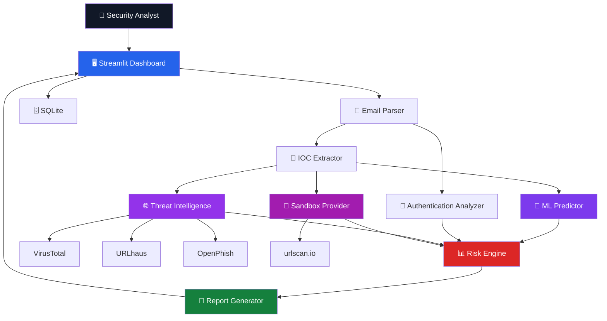
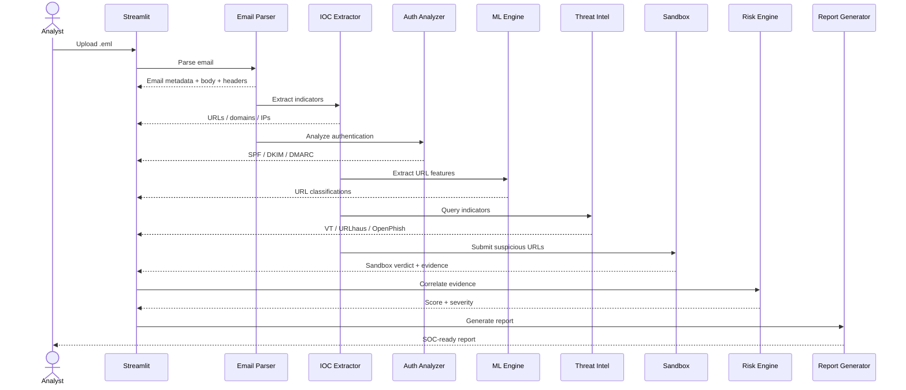
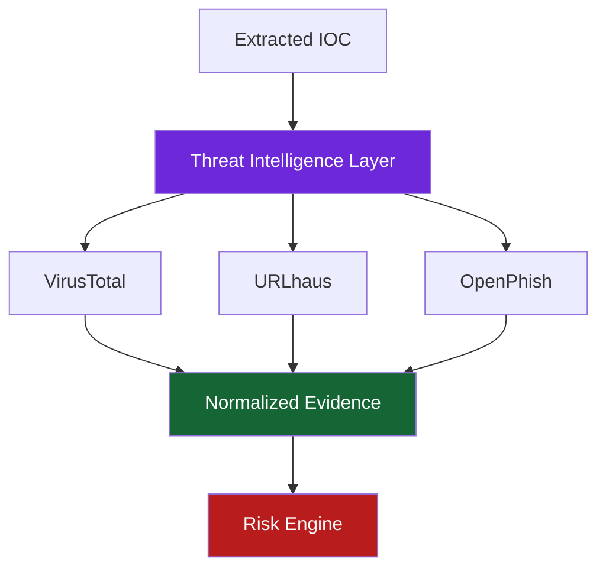
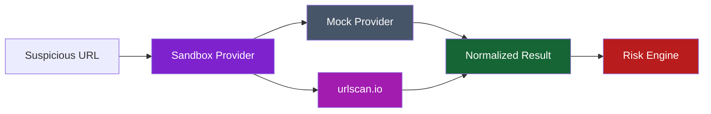
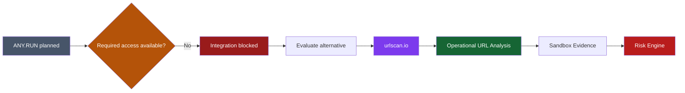
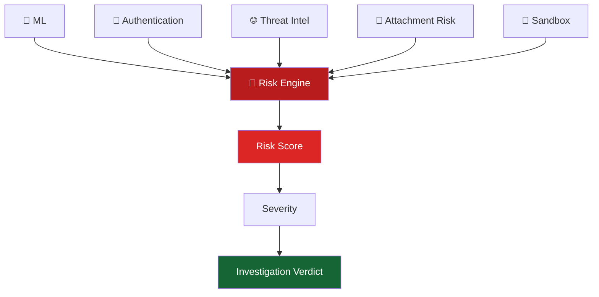
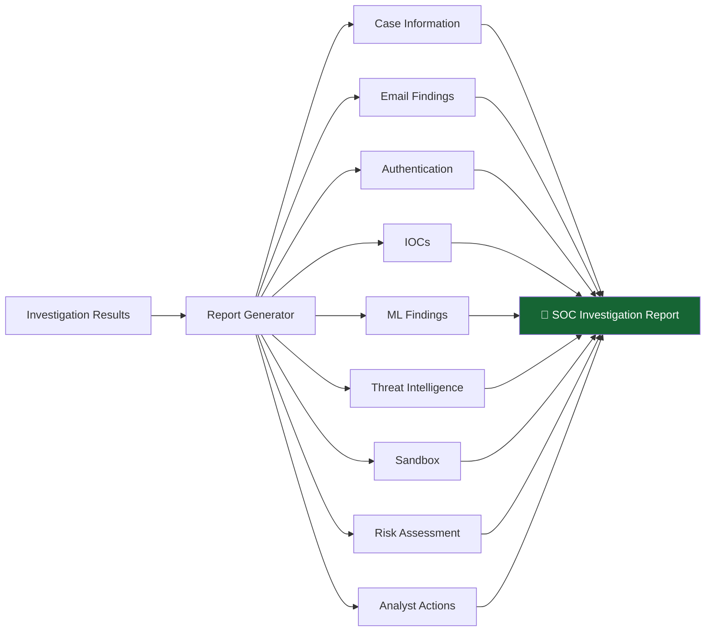
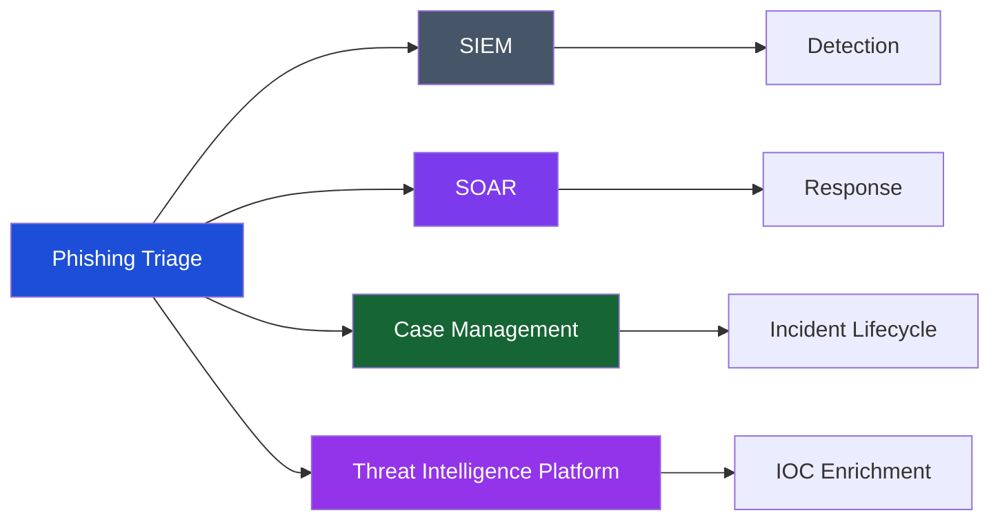

# 🛡️ Phishing Triage & Email Threat Analysis System

> **An end-to-end phishing investigation platform that turns a suspicious `.eml` file into structured evidence, threat intelligence, risk assessment, and a SOC-ready investigation report.**


---

## 📌 Overview

**Phishing Triage & Email Threat Analysis System** is a Python-based security investigation platform designed to automate the initial analysis of suspicious phishing emails.

Instead of requiring an analyst to manually inspect headers, URLs, authentication results, threat intelligence portals, sandbox results, and evidence, the system combines these investigation steps into a single workflow.

The system accepts a suspicious `.eml` file and produces:

- Parsed email information
- Extracted URLs, domains and other IOCs
- SPF / DKIM / DMARC analysis
- Machine-learning URL classification
- Threat intelligence enrichment
- Dynamic URL analysis through `urlscan.io`
- Evidence correlation
- Risk scoring and severity classification
- SOC-style investigation report

The goal is **not to replace a security analyst**, but to reduce repetitive first-level triage work and present the evidence in one place.

---

# 🎯 Problem

Phishing investigations often require analysts to move between multiple tools and manually correlate evidence.


This creates several practical problems:

- **Manual investigation** — repeated extraction and inspection across tools.
- **Fragmented evidence** — authentication, ML, TI and sandbox findings live in different places.
- **Inconsistent triage** — evidence can be interpreted differently between investigations.
- **Repetitive work** — many first-level phishing steps are automatable.
- **Difficult reporting** — findings still need to be converted into a structured report.

---

# 💡 Solution

The project combines first-level phishing investigation into one pipeline:


---

# 🏗️ System Architecture



---

# 🔄 Investigation Workflow



---

# 🧩 Core Components

## Email Parser
Processes `.eml` files and extracts sender, recipient, subject, headers, body, HTML, attachments and URLs.

## IOC Extraction
Extracts URLs, domains, IP addresses, email addresses and other observable indicators.

## Email Authentication
Analyzes SPF, DKIM and DMARC results and feeds authentication evidence into the risk engine.

---

# 🤖 Machine Learning

Three URL-classification models are included:

| Model | Purpose |
|---|---|
| Logistic Regression | Baseline classification |
| Random Forest | Current inference model |
| XGBoost | Benchmark / comparison |

Current configuration:

```env
ML_MODEL=random_forest
```

ML is **one evidence source**, not the final verdict.


---

# 🌐 Threat Intelligence

Supported providers:

- VirusTotal
- URLhaus
- OpenPhish



Provider responses are normalized and handled gracefully for clean, no-data and error cases.

---

# 🧪 Sandbox Analysis

The current operational sandbox provider is **urlscan.io**.



This implementation uses urlscan.io for **dynamic URL/web analysis**. It is not presented as a full replacement for an interactive malware-analysis VM.

---

# ❓ Why ANY.RUN Was Not Used

ANY.RUN was initially planned as the sandbox provider because it supports interactive analysis and API/SDK integrations.

During development, the required ANY.RUN API/account access could not be operationalized for this project.

Rather than leaving sandbox analysis unimplemented, **urlscan.io was selected as the operational URL-analysis alternative**.

The provider abstraction keeps the architecture open for ANY.RUN or another provider later.



This is an implementation constraint, not a claim that ANY.RUN is technically incapable of doing the job.

---

# 🧠 Evidence Correlation & Risk Engine

Evidence sources include:

- ML prediction
- Authentication
- Threat intelligence
- Attachment risk
- Sandbox analysis



Current categories:

| Severity | Score |
|---|---:|
| LOW | 0–24 |
| MEDIUM | 25–49 |
| HIGH | 50–74 |
| CRITICAL | 75–100 |

Current weights:

| Evidence Source | Weight |
|---|---:|
| ML Prediction | 25 |
| Authentication | 20 |
| Threat Intelligence | 30 |
| Attachment Risk | 15 |
| Sandbox | 10 |

---

# 📄 SOC Report



---

# 🗂️ Project Structure

```text
Phishing-Triage/
├── app.py
├── Dockerfile
├── docker-compose.yml
├── requirements.txt
├── .env.example
├── .gitignore
├── src/
│   ├── auth_analyzer.py
│   ├── database.py
│   ├── email_parser.py
│   ├── ioc_extractor.py
│   ├── ml_predictor.py
│   ├── process_kaggle.py
│   ├── report_generator.py
│   ├── risk_engine.py
│   ├── sandbox.py
│   ├── threat_intel.py
│   ├── train_model.py
│   └── url_features.py
├── tests/
├── samples/
├── Sample/
└── data/
```

---

# ⚙️ Configuration

Create `.env` from `.env.example`:

```env
ML_MODEL=random_forest

VIRUSTOTAL_ENABLED=false
VIRUSTOTAL_API_KEY=

URLHAUS_ENABLED=false
URLHAUS_AUTH_KEY=

OPENPHISH_ENABLED=false

SANDBOX_ENABLED=true
SANDBOX_PROVIDER=urlscan

URLSCAN_ENABLED=true
URLSCAN_API_KEY=
```

**Never commit `.env` or API credentials to GitHub.**

---

# 🚀 Running

```bash
git clone https://github.com/sujal2005code/Phishing-Triage.git
cd Phishing-Triage
```

### Windows

```powershell
python -m venv venv
.env\Scripts\Activate.ps1
pip install -r requirements.txt
copy .env.example .env
streamlit run app.py
```

### Linux / macOS

```bash
python3 -m venv venv
source venv/bin/activate
pip install -r requirements.txt
cp .env.example .env
streamlit run app.py
```

---

# 🐳 Docker

```bash
docker compose build
docker compose up
```

---

# 🧪 Testing

```bash
pytest
```

Sample emails are included for controlled testing.

---

# 📊 ML Evaluation

Development evaluation on the large URL dataset:

| Model | F1 | ROC-AUC |
|---|---:|---:|
| Logistic Regression | 0.8110 | 0.8939 |
| Random Forest | 0.8885 | 0.9550 |
| XGBoost | 0.8917 | 0.9576 |

The application currently uses **Random Forest** for inference. Other models remain for benchmarking and future experimentation.

---

# 🔬 Real-World Evaluation

A 60-email batch evaluation produced:

| Metric | Result |
|---|---:|
| True Positives | 21 |
| False Negatives | 9 |
| True Negatives | 14 |
| False Positives | 16 |
| Accuracy | 58.33% |
| Precision | 56.76% |
| Recall | 70.00% |
| F1 | 62.69% |

The evaluation exposed false-positive behavior from legitimate third-party resources such as Google Fonts. This reinforced the design decision to treat ML as **one evidence source** rather than the sole email verdict.

---

# 🛡️ Security & Privacy

- Never commit `.env`, API keys, tokens or credentials.
- External URL analysis sends submitted URLs to the selected provider.
- The project uses urlscan.io's Unlisted visibility configuration for its operational integration.
- Real emails may contain personal or confidential information; use sanitized samples where possible.

---

# 🧱 V1 Limitations

- ML primarily operates on URL-level features.
- Sandbox analysis is URL/web oriented.
- urlscan.io is not a full malware-analysis VM.
- External providers depend on API availability and quotas.
- Complex HTML emails may require further IOC normalization.
- Legitimate third-party resources can create false-positive ML signals.
- Final security decisions should remain analyst-driven.

---

# 🔮 Future Scope

### Detection
- Better URL normalization
- HTML-aware features
- Calibrated probabilities
- Ensemble models
- Email-level ML classification

### Threat Intelligence
- More providers
- Domain reputation
- Passive DNS
- WHOIS
- ASN/hosting information
- Certificate analysis
- Historical reputation

### Sandbox
- ANY.RUN integration when suitable access is available
- Additional sandbox providers
- Self-hosted analysis infrastructure
- File-analysis capabilities

### SOC Integration



Potential integrations include Splunk, Microsoft Sentinel, TheHive, MISP and other SIEM/SOAR platforms.

### Analyst Experience
- Case assignment
- Analyst notes
- Investigation history
- Role-based access
- Authentication
- Multi-user deployment
- Additional report formats

### Controlled Automated Response
- URL/domain blocking
- IOC submission
- Mail quarantine
- Incident ticket creation
- Controlled containment workflows

---

# 🧠 Design Principles

- **Evidence over assumptions**
- **Multiple signals**
- **Provider abstraction**
- **Graceful failure**
- **Analyst-in-the-loop**
- **Honest evaluation**

The central engineering idea is:

> **Collect multiple pieces of security evidence, normalize them, correlate them, calculate a risk signal, and present the investigation in a form a security analyst can use.**

---

# 🏁 V1 Status

| Component | Status |
|---|:---:|
| Project foundation | ✅ |
| Streamlit application | ✅ |
| `.eml` parsing | ✅ |
| IOC extraction | ✅ |
| SPF / DKIM / DMARC | ✅ |
| URL ML classification | ✅ |
| Logistic Regression | ✅ |
| Random Forest | ✅ |
| XGBoost | ✅ |
| VirusTotal | ✅ |
| URLhaus | ✅ |
| OpenPhish | ✅ |
| Mock sandbox | ✅ |
| urlscan.io sandbox | ✅ |
| Evidence correlation | ✅ |
| Risk engine | ✅ |
| SOC report generation | ✅ |
| End-to-end UI | ✅ |
| **V1** | **🟢 Complete** |

---

# 🛠️ Technology Stack

**Application:** Python, Streamlit

**Security:** Email/MIME analysis, SPF, DKIM, DMARC, IOC extraction, Threat Intelligence, URL analysis

**ML:** scikit-learn, Random Forest, Logistic Regression, XGBoost, pandas, NumPy, joblib

**External Services:** VirusTotal, URLhaus, OpenPhish, urlscan.io

**Storage:** SQLite

**Deployment:** Docker, Docker Compose

---

# 🎓 What This Project Demonstrates

- Security automation
- Phishing investigation
- SOC workflows
- Email security
- Threat intelligence
- IOC extraction
- ML for security
- API integration
- Risk scoring
- Evidence correlation
- Python application development
- Streamlit
- SQLite
- Docker
- Defensive security engineering

---

# 📌 Project

**Repository:** https://github.com/sujal2005code/Phishing-Triage

**Project:** Phishing Triage & Email Threat Analysis System

**Version:** V1 — Complete

---

## ⚠️ Disclaimer

This project is intended for educational, defensive-security and controlled research purposes.

Only analyze emails, URLs and other indicators that you are authorized to investigate.

External services may have their own terms, quotas, privacy requirements and data-retention policies. Configure and use them accordingly.
